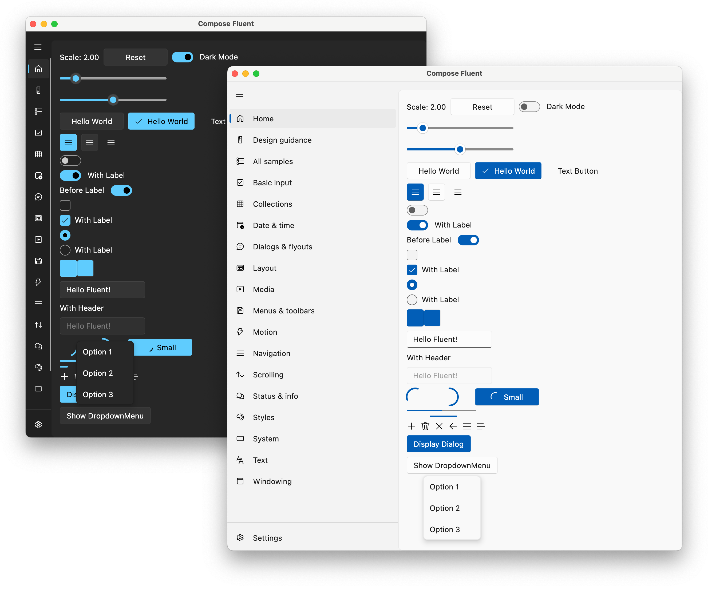

<h1> Compose Fluent</h1>

[](LICENSE)
[](https://github.com/NucleusFramework/compose-fluent-ui/releases)
[](https://central.sonatype.com/artifact/dev.nucleusframework.composefluent/fluent/)

> Fork of [compose-fluent/compose-fluent-ui](https://github.com/compose-fluent/compose-fluent-ui),
> maintained and updated on top of [Nucleus](https://github.com/NucleusFramework/Nucleus)
> (client-side decorated window, GraalVM native gallery builds).

**Fluent Design** UI library for **Compose Multiplatform**



## Current Status

Stable and in active use. The component set is broad, the public API is settled, and releases
follow semantic versioning — breaking changes only land in a new major version.

Some APIs are still opt-in behind `@ExperimentalFluentApi` — the material/backdrop layer and parts
of a few components. Those may change in a minor release; the annotation tells you exactly which
ones, so nothing changes under you without a compiler warning.

Feedback and contributions are welcome.

### Supported Kotlin Targets

| Target            | Platform              |
|:------------------|:----------------------|
| desktop           | Linux, macOS, Windows |
| iosArm64          | iPhone, iPad          |
| iosSimulatorArm64 | iOS Simulator         |
| androidTarget     | Android Devices       |
| wasmJs            | Web Browsers          |
| js                | Web Browsers          |

> `iosX64` was dropped: Compose Multiplatform 1.11 no longer publishes artifacts for it.

## Differences from the original project

This fork picks up [compose-fluent/compose-fluent-ui](https://github.com/compose-fluent/compose-fluent-ui),
which is no longer maintained, and adds the following.

### Full RTL support

Every component that encodes a direction — a fill, a travel path, a caret, a gesture — is now
mirrored in `LayoutDirection.Rtl` instead of staying left-to-right:

- `ProgressBar` fill and indeterminate segment travel, `Switcher` thumb travel
- `Slider` geometry, tick placement and drag gestures
- `RatingControl` clip shapes, `ColorPicker` absolute dot offsets and reversed slider gradients
- `BreadcrumbBar`, `PipsPager`, `FlipView`, `ListItem`, `Scrollbar` and `FontIcon` carets and chevrons

The approach is deliberate: rather than duplicating the geometry, the canvas is mirrored so the same
LTR math produces the RTL result. The gallery has an LTR/RTL toggle in its title bar to check any
component in both directions.

### Fewer recompositions

- Theme and style models (`Colors`, and the per-component style/shape holders) are annotated
  `@Immutable` / `@Stable`, so composables reading them can skip.
- Animation and size values are read at layout/draw time through lambda providers instead of being
  read in composition — an indeterminate `ProgressRing` or `ProgressBar` no longer recomposes on
  every frame, it only redraws.
- `Scrollbar` style allocation is hoisted out of the recomposition path.
- `IntRange`, `ClosedFloatingPointRange` and the `kotlinx.datetime` value types are declared stable
  through a shared [`compose_stability.conf`](compose_stability.conf), which the Compose compiler
  and the stability analyzer both read.
- [`compose-stability-analyzer`](https://github.com/skydoves/compose-stability-analyzer) is wired in
  so a regression in class stability fails the build rather than silently costing frames
  (`./gradlew :fluent:stabilityDump` to record a baseline, `:fluent:stabilityCheck` to verify it).
  Recomposition tracing is available behind `-PcomposeTrace=true`, and compiler reports behind
  `-PcomposeReports=true`.

### Nucleus window backend

The desktop chrome was a hand-rolled AWT window driving Win32 through JNA. It is now
[Nucleus](https://github.com/NucleusFramework/Nucleus)-backed via the new `decorated-window-fluent`
module — see [Window (desktop)](#window-desktop). That removes the JNA dependency and the
platform-specific title-bar code, and brings native window controls, the real Windows Mica/Acrylic
backdrop, native popup layers and window accessibility on Linux and macOS as well as Windows.

### Distribution

- Gallery installers are built as **GraalVM native images** (`.deb`, `.dmg`, `.exe`), so there is no
  bundled JVM and startup is immediate.
- Releases are tag-driven: pushing `vX.Y.Z` publishes every module to Maven Central and attaches the
  three installers to a GitHub release. No snapshot channel.
- Dependencies and the Gradle wrapper track current versions (Kotlin 2.4.10, Compose Multiplatform
  1.11.1, Gradle 9.5.1), and the wasm entry point was migrated off the removed `CanvasBasedWindow`.

## Quick Start

### Add Dependency

```kts
implementation("dev.nucleusframework.composefluent:fluent:1.0.0")
implementation("dev.nucleusframework.composefluent:fluent-icons-extended:1.0.0") // If you want to use full fluent icons.

// Desktop only: client-side decorated window and dialog backed by Nucleus/Tao.
implementation("dev.nucleusframework.composefluent:decorated-window-fluent:1.0.0")
```

Every release is published to Maven Central from a `vX.Y.Z` tag; check the
[latest version](https://central.sonatype.com/artifact/dev.nucleusframework.composefluent/fluent/).

### Gallery

Prebuilt native gallery installers (Linux `.deb`, macOS `.dmg`, Windows `.exe`) are attached to
each [GitHub release](https://github.com/NucleusFramework/compose-fluent-ui/releases), and the web
version is deployed to [GitHub Pages](https://nucleusframework.github.io/compose-fluent-ui/).

### Example

```kotlin
import io.github.composefluent.component.*

@Composable
fun App() {
  FluentTheme {
    Mica(Modifier.fillMaxSize()) {
      Column(Modifier.padding(24.dp)) {
        Button(onClick = {}) {
          Text("Hello Fluent Design")
        }
      }
    }
  }
}
```
See [`gallery`](gallery) module for more details.

- `FluentTheme()` is the context and entry point of the application, just like `MaterialTheme`
- Components are under `component` package
- `Mica` and `Layer` are under `background` package

## Components

### Layers
- Materials
  - [x] App Layer Mica
  - [x] App Layer Mica Alt
  - [x] App Layer Acrylic Default
  - [x] App Layer Acrylic Base
  - [x] App Layer Accent Acrylic Default
  - [x] App Layer Accent Acrylic Base
  - [x] App Layer Thin Acrylic
  - [x] Window Layer Mica *(Windows)*
  - [x] Window Layer Acrylic *(Windows)*
- Mica
  - [x] Simple Mica — flat `mica.base` fill
  - [x] Real Mica — native DWM backdrop on Windows (`Mica`, `Mica Alt`, `Acrylic`) through
    Nucleus `WindowsBackdrop`; blur-based fallback elsewhere
- Layer
  - [x] Simple Layer
  - [x] Real Layer — real gaussian blur of the in-app backdrop via `hazeSource`/`hazeEffect`
- [x] Card

App-level materials (`Mica`, `Material`, `MaterialContainer`) blur the content behind them on
every skiko target. The *window*-level backdrop, which lets the desktop wallpaper show through the
window itself, is Windows-only and comes from the decorated window; the gallery exposes it under
Settings → Window backdrop.

### Basic Components

- [x] Buttons
  - [x] Button
  - [x] Accent Button
  - [x] Subtle Button
  - [x] Dropdown Button
  - [x] Hyperlink Button
  - [x] Repeat Button
  - [x] Toggle Button
  - [x] Split Button
  - [x] Toggle Split Button
- [x] Radio Button
- [x] Toggle Switch
- [x] Check Box
  - [x] TriState Check Box
- [x] Combo Box (Simple)
- [x] Progress Bar
- [x] Progress Ring
- [x] Slider
- [x] Text Field
- [X] Text

- [x] Color Picker
- [x] Rating Control
- [x] Pill Button
- [x] Segmented Button
- [x] Lite Filter
- [x] List Item
- [x] Tree View Item
- [x] Grid View Item
- [x] Flip View
- [x] Pips Pager 

### Compound Components

- [x] Calendar View (Simple)
  > If you need running on the Android 7.1 and below, you should enable [core library desugar](https://developer.android.com/studio/write/java8-support#library-desugaring) to avoid crash.
- [x] Calendar Date Picker
- [x] Date Picker (wheel)
- [x] Time Picker
- [x] Color Picker
- [ ] Navigation
  - [x] Side Nav
  - [x] Top Nav
  - [x] Navigation View
  - [x] Breadcrumb Bar
  - [ ] Pivot
  - [x] Tab View
  - [x] Selector Bar 
- [x] Tooltip
- [x] Info Bar
- [x] Badge 
- [ ] File Picker
- [x] Menu Bar (Simple)
- [x] MenuFlyout (Simple)
- [x] Expander
- [x] Command Bar
- [x] Command Bar Flyout
- [x] Auto Suggest Box

### Dialogs

- [x] Fluent Dialog
- [x] Content Dialog
- [x] Flyout (Simple)
- [x] Teaching Tip

### Animations

- [x] Animation Preset Constants (Duration, Easing Functions)

### Theme

- [x] Light and Dark theme
- [x] Custom accent color — `lightColors(accent = …)` / `darkColors(accent = …)` derive the whole
  shade set from any `Color`
- [x] Follow the OS dark mode (desktop, via the Nucleus dark-mode detector)
- [x] RTL / mirrored layouts

### Window (desktop)

Provided by the `decorated-window-fluent` module on top of
[Nucleus](https://github.com/NucleusFramework/Nucleus):

- [x] Client-side decorated window and dialog with a Fluent title bar
- [x] Native window controls, drag regions and snap behaviour
- [x] Native Mica / Mica Alt / Acrylic window backdrop *(Windows)*
- [x] Title bar and chrome themed from the ambient `FluentTheme` colors
- [x] Native popup layers, so menus and flyouts can extend past the window bounds

### Accessibility

- [x] Semantic roles and state on interactive components (`Role.Checkbox`, `Role.Switch`,
  `Role.RadioButton`, `toggleable`/`selectable` semantics, icon content descriptions)
- [x] Screen-reader support for the decorated window: the Nucleus Tao backend bridges the Compose
  semantics tree to the platform accessibility API
- [ ] `Slider` semantics (still a TODO in the component)

## Contribution

See [CONTRIBUTION.md](CONTRIBUTION.md)

## License

This library is licensed under the Apache License 2.0.

The copyright of the icon assets (in `io.github.composefluent.icons` package) belongs to Microsoft.

## Credits

This project is built upon the foundations laid by several remarkable open-source projects. We extend our sincere gratitude to the developers and maintainers of these projects for their invaluable contributions to the open-source community.

### Fluent

| Project | Description | License |
|---|---|---|
| **[Windows UI Kit (Figma)](https://www.figma.com/community/file/1440832812269040007/windows-ui-kit)** | Provided design mockups for controls. | [CC BY 4.0](https://creativecommons.org/licenses/by/4.0/) |
| [JetBrains/compose-multiplatform](https://github.com/JetBrains/compose-multiplatform) | Provides the fundamental framework for Compose Multiplatform development. | [Apache License 2.0](https://github.com/JetBrains/compose-multiplatform/blob/master/LICENSE.txt) |
| [Kotlin/kotlinx-datetime](https://github.com/Kotlin/kotlinx-datetime) | Provides a unified clock API. | [Apache License 2.0](https://github.com/Kotlin/kotlinx-datetime/blob/master/LICENSE.txt) |
| [chrisbanes/haze](https://github.com/chrisbanes/haze) | Offers essential implementations for acrylic and mica effects. | [Apache License 2.0](https://github.com/chrisbanes/haze/blob/main/LICENSE) |

### Fluent-Icons
| Project | Description | License |
|---|---|---|
| [microsoft/fluentui-system-icons](https://github.com/microsoft/fluentui-system-icons) | Supplies the icon assets used in the project. | [MIT License](https://github.com/microsoft/fluentui-system-icons/blob/main/LICENSE) |
| [DevSrSouza/svg-to-compose](https://github.com/DevSrSouza/svg-to-compose) | Facilitates the conversion of SVG icons to Compose icons, aiding in the implementation of Fluent icons. | [MIT License](https://github.com/DevSrSouza/svg-to-compose/blob/master/LICENSE) |

### Gallery
| Project | Description | License |
|---|---|---|
| [NucleusFramework/Nucleus](https://github.com/NucleusFramework/Nucleus) | Provides the decorated window and dialog, native window controls, the Windows Mica/Acrylic backdrop, window accessibility, OS dark-mode detection and the GraalVM native packaging of the gallery. | [Apache License 2.0](https://github.com/NucleusFramework/Nucleus/blob/main/LICENSE) |
| [google/ksp](https://github.com/google/ksp) | Along with KotlinPoet, helps with source code generation for examples and navigation logic. | [Apache License 2.0](https://github.com/google/ksp/blob/main/LICENSE) |
| [square/kotlinpoet](https://github.com/square/kotlinpoet) | Along with KSP, helps with source code generation for examples and navigation logic. | [Apache License 2.0](https://github.com/square/kotlinpoet/blob/main/LICENSE.txt) |
| [SnipMeDev/Highlights](https://github.com/SnipMeDev/Highlights) | Enables syntax highlighting for example code. | [Apache License 2.0](https://github.com/SnipMeDev/Highlights/blob/main/LICENSE) |
| [yshrsmz/BuildKonfig](https://github.com/yshrsmz/BuildKonfig) | Facilitates the generation of build configuration parameter classes. | [Apache License 2.0](https://github.com/yshrsmz/BuildKonfig/blob/master/LICENSE) |
