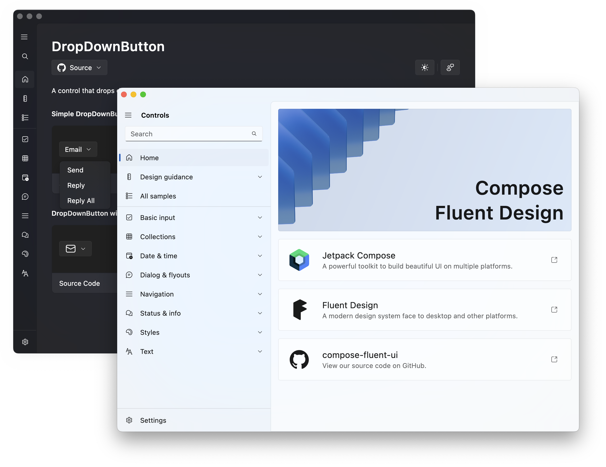

<h1> Compose Fluent</h1>

[](LICENSE)
[](https://github.com/Konyaco/compose-fluent-ui/releases)
[](https://central.sonatype.com/artifact/com.konyaco/fluent/)


**Fluent Design** UI library for **Compose Multiplatform**



## Current Status

> This library is experimental, any API would be changed in the future without any notification.

Please note that there are lots of hard-coding and workarounds in our source code, which we plan to eliminate in the future.

Thank you for using our library. We look forward to receiving your feedback and contributions!


## Quick Start

### Add Dependency

```kts
implementation("com.konyaco:fluent:0.0.1-dev.8")
implementation("com.konyaco:fluent-icons-extended:0.0.1-dev.8") // If you want to use full fluent icons.
```

### Example

```kotlin
import com.konyaco.fluent.component.*

@Composable
fun App() {
  FluentTheme {
    Mica(Modifier.fillMaxSize()) {
      Column(Modifier.padding(24.dp)) {
        Button(onClick = {}) {
          Text("Hello Fluent Design")
        }
      }
    }
  }
}
```
See [`gallery`](gallery) module for more details.

- `FluentTheme()` is the context and entry point of the application, just like `MaterialTheme`
- Components are under `component` package
- `Mica` and `Layer` are under `background` package

## License

This library is under Apache-2.0 license.

The copyright of the icon assets (in `com.konyaco.fluent.icons` package) belongs to Microsoft.

## Components

### Layers

- Mica
  - [x] Simple Mica
  - [ ] Real Mica
- Layer
  - [x] Simple Layer
  - [ ] Real Layer
- [x] Acrylic
- [x] Card

### Basic Components

- [x] Buttons
  - [x] Button
  - [x] AccentButton
  - [x] SubtleButton
  - [x] DropdownButton
  - [x] HyperlinkButton
  - [x] RepeatButton
  - [x] ToggleButton
  - [x] SplitButton
  - [x] ToggleSplitButton
- [x] RadioButton
- [x] ToggleSwitch
- [x] CheckBox
  - [ ] TriStateCheckBox
- [x] ComboBox (Simple)
- [x] ProgressBar
- [x] ProgressRing
- [x] Slider
- [x] TextField

- [x] ColorPicker
- [x] RatingControl
- [ ] Pill Button

### Compound Components

- [x] CalendarView (Simple)
- [x] DateTimePicker (Simple)
- [x] Color Picker
- [ ] Navigation
  - [x] SideNav
  - [ ] BreadcrumbBar
  - [ ] Pivot
  - [ ] TabView
- [ ] Tooltip
- [ ] InfoBar
- [ ] FilePicker
- [ ] Menu

### Dialogs

- [x] FluentDialog
- [x] ContentDialog
- [x] Flyout (Simple)

### Animations

- [x] Animation Preset Constants (Duration, Easing Functions)

### Theme

- [x] Light and Dark theme
- [ ] Custom accent color

### Accessibility

- [ ] Accessibility Semantics
